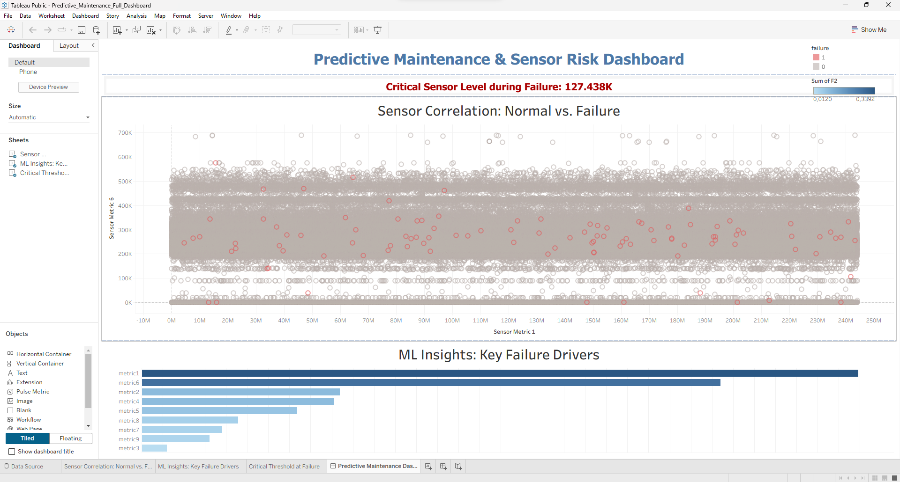

# 🛠️ Industrial Predictive Maintenance: Sensor Risk Analysis

## 📌 Project Overview
This project focuses on **Predictive Maintenance** for industrial equipment using **Machine Learning**. By analyzing real-world sensor data (Temperature, Rotational Speed, Torque, etc.), the goal is to identify patterns that lead to equipment failure and build a predictive model to prevent costly downtime.

## 🎯 Objectives
*   Analyze high-frequency sensor data to detect anomalies.
*   Determine the **Root Causes** of machine breakdowns using statistical profiling.
*   Implement a **Random Forest Classifier** to predict failures before they occur.
*   Develop an interactive **Tableau Dashboard** for real-time risk monitoring.

## 🛠 Tools & Technologies
*   **Language:** Python (Pandas, Matplotlib, Seaborn)
*   **Machine Learning:** Scikit-learn (Random Forest)
*   **BI Visualization:** Tableau Desktop / Tableau Public
*   **Analytics:** Feature Importance & Correlation Heatmaps

## 📊 Methodology & Process
1.  **Data Pre-processing & Cleaning:** Standardized sensor columns programmatically by removing spaces and special characters (`str.replace('[', '')`) to ensure clean feature manipulation. Dropped non-predictive metrics (e.g., `UDI`, `Product_ID`) to avoid noise.
2.  **Exploratory Data Analysis (EDA):** Built a correlation matrix to isolate how specific parameters shift during failure windows. Exported baseline profiles of failing machines to `failure_event_profiles.csv`.
3.  **Model Engineering:** Implemented **Stratified Splitting** (`stratify=y`) to maintain proportion across the highly imbalanced target classes, guaranteeing that rare failure instances were fairly evaluated during testing.
4.  **Feature Importance Analytics:** Evaluated structural indicators via internal Random Forest weights, exporting the final priority list to `sensor_importance_ranking.csv` for shop-floor action.

## 🎯 Model Performance & Evaluation Philosophy
In industrial predictive maintenance, simple **Accuracy is a deceptive metric** due to severe class imbalance (machine failures represent only a tiny fraction of the dataset). If a model simply predicts "No Failure" for every machine, it can achieve 98% accuracy while being completely useless in production.

*   **Stratified Approach:** Using stratification during the train/test split ensures the testing data reflects genuine operational risk frequencies.
*   **Optimization Goal:** The Random Forest Classifier was built with a primary focus on **Recall** (minimizing False Negatives) to ensure that critical mechanical faults are caught before a catastrophic breakdown occurs, directly reducing factory downtime.

## 🛠 Technical Challenges & Data Decisions
*   **Class Imbalance Realities:** Because machinery failures are statistically rare, standard unweighted models overlook them. This pipeline relies on proper stratification and automated data-cleaning steps to prevent the model from ignoring critical risk patterns.
*   **Operational Explainability:** Instead of leaving the model as a "black box," the internal feature importance rankings were isolated and visually plotted. This allows engineering teams to know exactly which high-risk sensor thresholds demand immediate maintenance priority.

## 📷 Dashboard & Visuals
### Industrial Monitoring Dashboard

## 🔗 Live Interactive Dashboard
[View on Tableau Public](https://public.tableau.com/views/Predictive_Maintenance_Full_Dashboard/PredictiveMaintenanceDashboardEnergySector?:language=en-US&:sid=&:redirect=auth&:display_count=n&:origin=viz_share_link)

## 🚀 Skills Demonstrated
*   **Predictive Analytics** & Balanced Classification
*   **Industrial IoT Data Handling** (Imbalanced Datasets)
*   **Machine Learning Interpretability** (Feature Importance Diagnostics)
*   **Data Storytelling** & KPI Mapping (Tableau Design)
